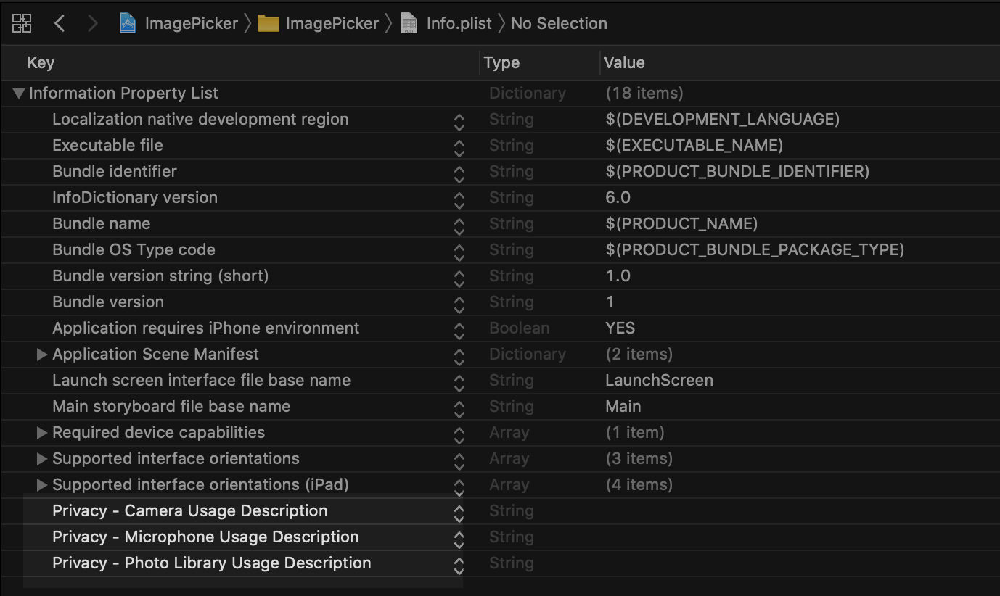

#  ImagePicker

## Mục đích
- Lấy ảnh từ thư viện trên thiết bị
- Chụp ảnh bằng camera

## Chỉnh sửa file info.plist

- Edit trong source code (file xml)

```
<key>NSCameraUsageDescription</key>
<string></string>
<key>NSMicrophoneUsageDescription</key>
<string></string>
<key>NSPhotoLibraryUsageDescription</key>
<string></string>
```
- Hoặc edit trong Properties List

